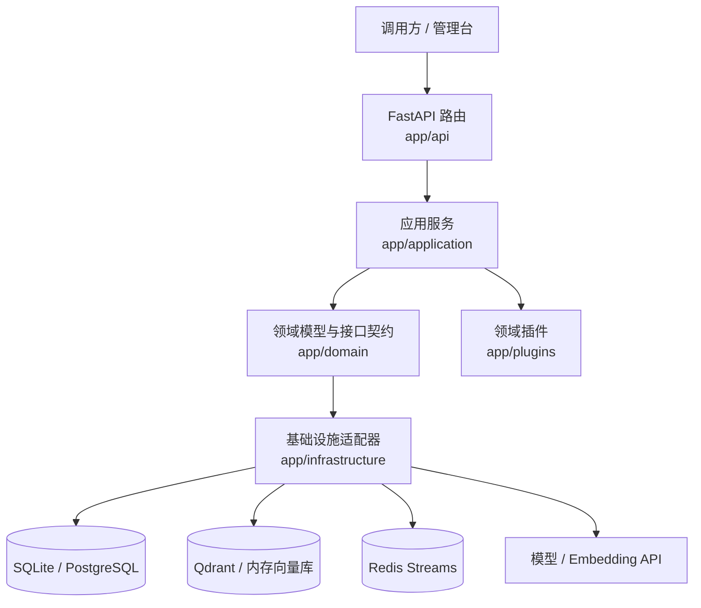
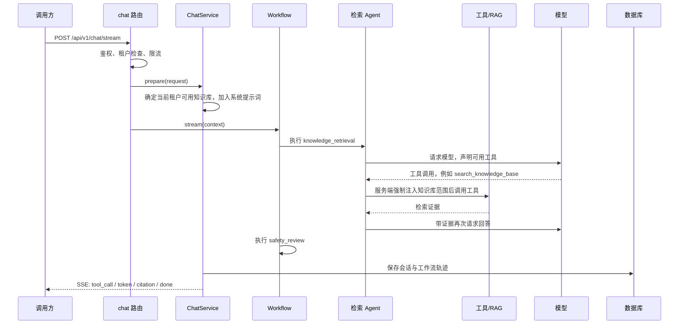

# 后端中文导读

这份文档面向刚接触 Python 的维护者。目标不是要求你一次读懂所有代码，而是让你能先定位问题，再沿着一条完整业务链路理解项目。

## 先记住这张图



从上往下看，职责依次是：

1. `app/api`：接收 HTTP 请求、鉴权、校验输入、返回 HTTP/SSE 响应。这里不写复杂业务规则。
2. `app/application`：编排业务流程，例如聊天、检索、文档解析、评测。
3. `app/domain`：描述项目中的数据长什么样，以及上层允许依赖哪些能力。
4. `app/infrastructure`：真正连接数据库、Redis、Qdrant、文件系统、模型 API。
5. `app/plugins`：放保险这个默认行业的提示词、工具白名单、工作流、种子数据。换行业主要改这里。

这种分层的直接好处是：替换数据库、模型或行业规则时，不需要从 API 路由一路改到业务代码。

## 最短阅读路线

建议按下面顺序打开文件，不必先看 SQLAlchemy 的表定义：

1. [`app/main.py`](../app/main.py)：程序从哪里启动，路由怎样挂载。
2. [`app/bootstrap/container.py`](../app/bootstrap/container.py)：所有服务和外部依赖怎样组装在一起。
3. [`app/api/routes/chat.py`](../app/api/routes/chat.py)：聊天 HTTP 请求如何进入系统。
4. [`app/application/chat/service.py`](../app/application/chat/service.py)：一次聊天怎样准备上下文、保存记录、输出 SSE。
5. [`app/application/workflow/engine.py`](../app/application/workflow/engine.py) 与 [`app/application/agent/agents.py`](../app/application/agent/agents.py)：Agent 工作流如何执行工具调用与安全审查。
6. [`app/application/rag/service.py`](../app/application/rag/service.py)：RAG 怎样索引文档、融合向量和关键词结果。
7. [`app/plugins/insurance.py`](../app/plugins/insurance.py)：保险领域实际提供了什么。
8. [`app/infrastructure/persistence/sqlalchemy.py`](../app/infrastructure/persistence/sqlalchemy.py)：需要查数据落在哪里时再看。

## 一次聊天是怎样流动的



关键边界：模型只能“建议调用哪个工具”，但不能自行决定 `tenant_id` 或 `knowledge_base_id`。服务端会覆盖这些参数，避免模型或提示词注入跨租户读取数据。

## 文档上传与异步索引

上传原文件后，系统会先解析出文本，再建立向量索引。文档记录会经历：

```text
上传文件 -> parsed -> indexing -> ready
                         \-> failed
```

- 本地 `inline` 队列：请求内完成索引，适合开发。
- Redis 队列：接口只创建任务，`app/worker.py` 在后台索引，适合生产。
- 原文件保存在对象存储，解析出的文本保存在文档仓库，向量保存在向量库。这三者各自负责不同事情。

从接口进入点开始看：[`app/api/routes/admin.py`](../app/api/routes/admin.py)。解析器在 [`app/application/documents/ingestion.py`](../app/application/documents/ingestion.py)，后台任务在 [`app/worker.py`](../app/worker.py)。

## 配置为什么要保存完整快照

运行配置可通过管理接口更新模型、RAG 参数、系统提示词和工作流。每一次发布都保存一份完整快照，而不是只保存“这次改了什么”。

例如：

```text
版本 1: 模型 A + Top K=4 + 工作流 X
版本 2: 模型 B + Top K=6 + 工作流 X
```

重新发布版本 1 时，系统可以完整恢复模型 A 和 Top K=4。如果只保存“版本 1 改了模型 A”，Top K 可能仍然错误地停留在 6。

实现入口在 [`AppContainer.create_and_publish_runtime`](../app/bootstrap/container.py)，版本存储在 `config_versions` 表。Redis 配置广播用于通知其他 API 实例刷新已发布配置。

## Python 速查

| 写法 | 可以先这样理解 |
| --- | --- |
| `class X:` | 定义一个对象类型，把相关数据和函数放在一起。 |
| `def f(...):` | 普通函数；执行 CPU 计算或同步数据库调用时常见。 |
| `async def f(...):` | 异步函数；可在等待网络、模型、Redis 时让出执行权。 |
| `await something()` | 等待异步操作完成，但不阻塞其他请求。 |
| `asyncio.to_thread(func, ...)` | 把旧式同步库放到线程中执行，避免阻塞 FastAPI 的事件循环。 |
| `@dataclass` | 自动生成初始化方法的数据类，适合内部状态。 |
| `BaseModel` | Pydantic 数据模型；负责校验 API 输入和输出。 |
| `Protocol` | 接口约定；例如向量库只要实现约定的方法即可替换。 |
| `dict[str, Any]` | 字典，键是字符串，值可以是任意类型。 |
| `list[X]` / `X | None` | 类型提示，分别表示“X 列表”和“X 或空值”。 |

`async` 不等于自动多线程。这里的原则是：网络 I/O 使用 `await`，同步数据库/文件库通过 `asyncio.to_thread` 隔离。这样多个请求等待外部服务时，API 仍可以处理其他请求。

## 常见修改从哪里开始

| 想做的事 | 首先看哪里 | 通常还要改哪里 |
| --- | --- | --- |
| 新增一个行业 | `app/plugins/base.py`、`app/plugins/insurance.py` | 新插件、`registry.py`、评测集。 |
| 新增模型供应商 | `app/domain/ports.py` 的 `ModelClient` | `app/infrastructure/model_clients/` 和 `factory.py`。 |
| 新增一个 Agent 工具 | `app/application/agent/business_tools.py` | 注册表、插件工具白名单、测试。 |
| 调整检索策略 | `app/application/rag/service.py` | 评测集与 RAG 测试。 |
| 支持新的文件格式 | `app/application/documents/ingestion.py` | 依赖、上传测试、README。 |
| 修改数据库结构 | `app/infrastructure/persistence/sqlalchemy.py` | 新增 Alembic 迁移，不要只改 Python 表定义。 |
| 新增管理接口 | `app/domain/models.py` | 对应 API route、应用服务、测试和审计。 |

## 两条维护规则

1. 不要让 API 路由直接写 SQL 或直接调用第三方模型。路由应保持薄，只负责 HTTP；业务放在 `application`，连接细节放在 `infrastructure`。
2. 修改有副作用的流程时，先补测试。尤其是租户范围、文档删除、配置发布、任务重试和工具参数注入。

## 验证后端改动

在项目根目录执行：

```bash
.venv/bin/ruff check app tests migrations
.venv/bin/python -m compileall -q app migrations
.venv/bin/pytest -q
```

如果改了表结构，再执行：

```bash
.venv/bin/alembic upgrade head
.venv/bin/alembic check
```

`alembic check` 的含义是：当前 SQLAlchemy 表定义与迁移历史相比，没有遗漏需要新建的迁移。
